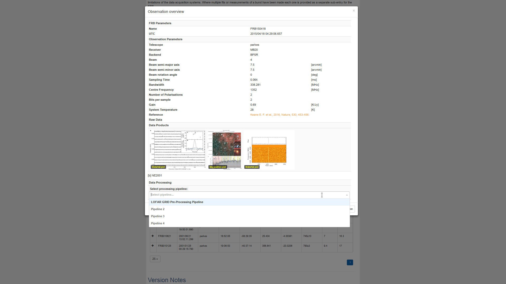

# Sprint Name 

INTERSTELLAR

# Team leader

Ronald van Haren (portal)

Arnold Kuzniar (FAIR)
# Target project 

European Open Science Cloud pilot for LOFAR (EOSCpfL)

# Expertise required

REST

Python

Web (Javascript / REACT)

RDF / Linked data

# Size of team

5 (~3 portal, ~2 FAIR)

# Description

### Project background
The EOSCpfL project is a short (0.5 FTE on our side, total 1 FTE) demonstrator project together with ASTRON for the [European Open Science Cloud (EOSC)](https://ec.europa.eu/research/openscience/index.cfm?pg=open-science-cloud). The overall goal of the project is to build a demonstrator that facilitates astronomers processing LOFAR data in order to increase the scientific output of the [LOFAR long term archive, LTA](https://lta.lofar.eu/). In order to accomplish this we can split the work to be done in two subtasks (note that there is some dependence between them):
* Building a data processing portal
* Make the LTA more FAIR

### Task description  - portal
We will build a modified version of the [Fast Radio Bursts (FRB)](http://www.frbcat.org) Catalogue created in the AA-ALERT project. However, both the data and functionality of this portal will be different:
* we need to get the data in through a python library instread of directly from a database
* we need to launch workfows directly from the portal

This leads us to the following tasks:
* design/build a REST API that allows for the following functionality:
    - provide LTA data to the web portal
    - provide list of available workflows/pipelines to run
    - provide configuration options (JSON schema) for selected pipeline
    - launch pipeline for selected observation and (modified) configuration
* adapt portal to use REST API & changed data
* reimplement one of the pipeline launchers (python) to use JSON schema configuration and bring it up to our standards

Two screenshots of how the portal could look like (old data, hardcoded JSON schema, no usage of REST API) are included below. The first screenshot shows the available pipelines, the second screenshot shows the editeable configuration for the pipeline and a 'submit workflow' button.

### Task description  - FAIR

# Goals
* design/build REST API for data processing portal
* adapt web portal to use REST API & LOFAR data
* reimplement one of the existing pipeline launchers
* 

