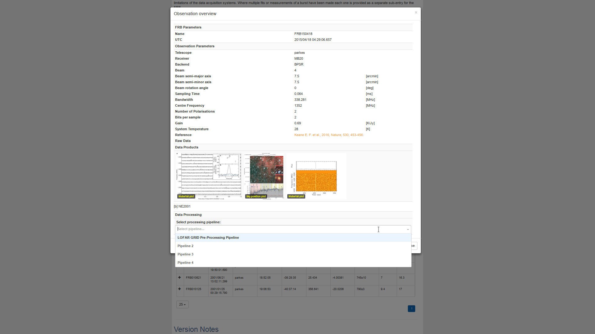
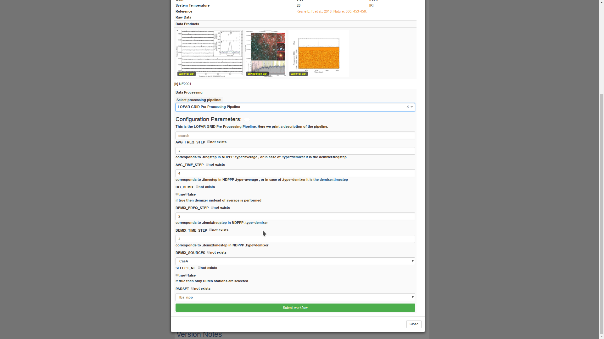
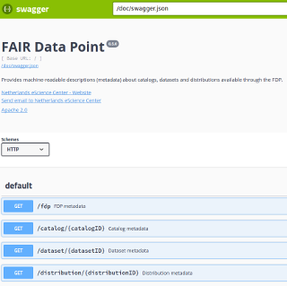
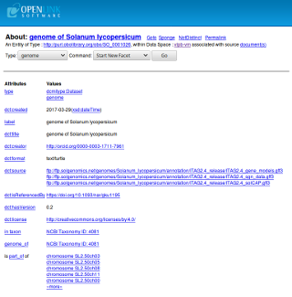

# Sprint Name

INTERSTELLAR

# Team leader

Ronald van Haren (portal)

Arnold Kuzniar (FAIR)
# Target project

European Open Science Cloud pilot for LOFAR (EOSCpfL)

# Expertise required

REST

Python

Web (Javascript / REACT)

RDF / Linked data

Docker

# Size of team

5 (~3 portal, ~2 FAIR)

# Description

### Project background
The EOSCpfL project is a short (0.5 FTE on our side, total 1 FTE) demonstrator project together with ASTRON for the [European Open Science Cloud (EOSC)](https://ec.europa.eu/research/openscience/index.cfm?pg=open-science-cloud). The overall goal of the project is to build a demonstrator that facilitates astronomers processing LOFAR data in order to increase the scientific output of the [LOFAR long term archive, LTA](https://lta.lofar.eu/). In order to accomplish this we can split the work into two subgoals (note that there is some dependence between them):
* Building a data processing portal
* Make the LTA (meta)data more FAIR

### Task description  - portal
We will build a modified version of the [Fast Radio Bursts (FRB)](http://www.frbcat.org) Catalogue created in the AA-ALERT project. However, both the data and functionality of this portal will be different:
* we need to get the data in through a python library instead of directly from a postgres database
* we need to launch workflows directly from the portal

This leads us to the following tasks:
* design/build a REST API that allows for the following functionality:
    - provide LTA data to the web portal
    - provide list of available workflows/pipelines to run
    - provide configuration options (JSON schema) for selected pipeline
    - launch pipeline for selected observation and (modified) configuration
* adapt portal to use REST API & LOFAR data
* re-implement one of the pipeline launchers (existing python code) to use JSON schema based configuration and bring it up to our standards

Two screenshots of how the portal could look like (using unrelated astronomy data, hard-coded JSON schema for configuration options, no usage of REST API yet) are included below. The first screenshot shows the available (dummy) pipelines, the second screenshot shows the editable configuration for the pipeline and a 'submit workflow' button.

### Task description  - FAIR
* assess the FAIRness of the LOFAR data services (using the [FAIR Metrics](http://fairmetrics.org/))
* identify relevant data or tables in the [LOFAR DBView](https://lta-dbview.lofar.eu/DbView)
* access/query the (meta)data in the Oracle RDBMS (DB access arranged)
* structure the data according to the following hierarchy: _catalog_->_dataset_->_distribution_ as used by the [FAIR Data Point](https://www.research-software.nl/software/fairdatapoint) web service
* make the (meta)data available in machine-readable and semantically interoperable format(s)
  - identify terms in (domain-specific) vocabularies and ontologies (e.g. DCMI, IVOA Ontology)
  - "semantify" or generate RDF graph(s) through mappings to the source data(base)
  - Linked Data deployment on SURFsara's HPC Cloud (e.g. using the OpenLink's Virtuoso server)

Screenshots of the example services are shown below (with non-astronomy data).

# Goals
* design/build REST API for data processing portal
* adapt web portal to use REST API & LOFAR data
* re-implement one of the existing pipeline launchers
* make LTA (meta)data more FAIR through available services
* dockerize services

